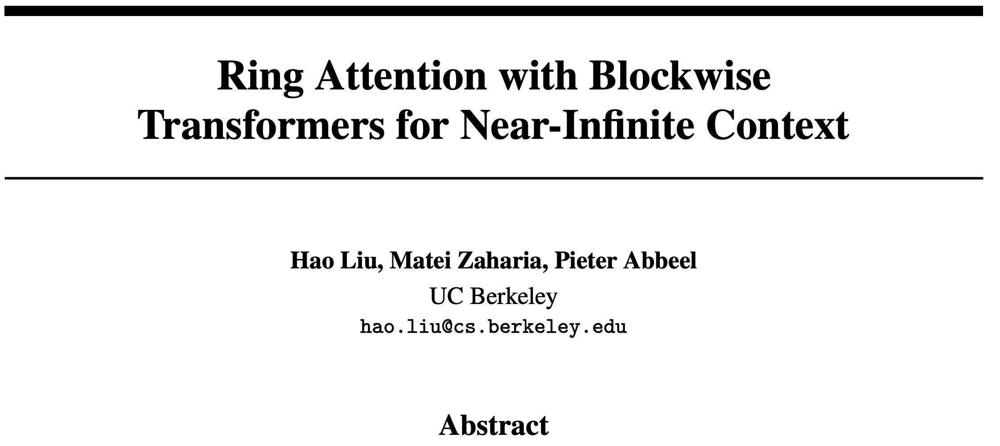

# Ring Attention

Siyuan Wang · NiubAI · 2026-10-04

---
layout: section
---

# 问题

长序列把 Transformer 卡住了

---

# Abstract

> Transformer 已经成为许多最先进人工智能模型所采用的主流架构，并在广泛的 AI 应用中展现出了卓越的性能。然而，Transformer 对内存的巨大需求限制了其处理长序列的能力，因此在复杂环境中利用视频、动作以及其他长序列和长模态数据时面临挑战。

> 我们提出了一种新的方法——结合分块 Transformer 的环形注意力机制（Ring Attention with Blockwise Transformers，简称 Ring Attention）。该方法通过对自注意力层和前馈网络进行分块计算，将长序列分布到多个设备上；与此同时，它能够将 Key-Value（KV）块之间的通信过程与分块注意力的计算过程完全重叠，从而隐藏通信开销。

> 我们的方法能够支持训练和推理长度最多扩大到原来的“设备数量倍”的序列，相比此前的内存高效 Transformer 方法，可处理显著更长的上下文。同时，该方法不需要引入任何近似计算，也不会带来额外的通信或计算开销。

> 我们在语言建模和强化学习任务上进行了大量实验，结果表明，该方法能够有效支持百万 token 级别的上下文长度，并进一步提升模型性能。

---

# Introduction

- Transformer现在已经是很多AI系统的重要架构了

- self-attention的内存需要和上下文长度是平方关系，scale上下文长度是一个挑战

- 有很多的研究使用blockwise方式计算attention和FFN，避免实例化一整个attention矩阵（FlashAttention）

- Batchsize=1 context length=100M hidden size=1024, 需要1000GB+ VRAM

> 其实这里我也没有很懂， 100M * 1024 × 2B = 200GB，很诡异

---

# Large Context Memory Constraint

Given input sequences $Q, K, V \in \mathbb{R}^{s \times d}$, where $s$ is the sequence length and $d$ is the head dimension, we compute the matrix of outputs as:

$$
\mathrm{Attention}(Q, K, V) = \mathrm{softmax}\left(\frac{QK^\top}{\sqrt{d}}\right)V,
$$

where softmax is applied row-wise.

Each self-attention sub-layer is accompanied by a feedforward network (FFN), which is applied to each position separately and identically. It consists of two linear transformations with a ReLU activation in between:

$$
\mathrm{FFN}(x) = \max(0, xW_1 + b_1)W_2 + b_2.
$$

---

# Ring Attention with Blockwise Parallel Transformers

换句话说，随着上下文长度增加，我们在一台机器上进行attention计算已经很困难了

那么有什么办法可以减少这个负担呢？

一种方案是，沿着hidden dim的维度将序列进行切分（其实就是按照head dim划分，让不同的机器在计算的时候会拿到全部的上下文，但是只有一部分head，算完了之后再拼回来）

<WatchCard bvid="BV1QnHozDEWw" />

但是有一个问题，当我们的长度只是从10k→100k的时候，这样的方式可能是有效的

但是当我们的长度从100k→10M的时候，这样的方式可能就行不通了（毕竟你的head的数量是有限的，我总不能让一个机器只拿到半个Head的hidden吧🤷）

---
layout: statement
---

# Ring Attention

分块计算 + 环形通信重叠

---

# Ring Attention with Blockwise Parallel Transformers

如果我们想要在更长的上下文上训练，ulysses这样沿着hidden dim切分的方法可能就是治标不治本了

我们还是需要把上下文切开: Ring Attention

让我们先举一个最简单的例子，self-attention, 没有causal mask

- 把输入序列切成多块:

$$
Q = [Q_1, Q_2, \ldots, Q_n], \quad K = [K_1, K_2, \ldots, K_n], \quad V = [V_1, V_2, \ldots, V_n]
$$

- 每个GPU拿自己对应的$Q_i, K_i, V_i$
- 计算自己拿到的部分的attention: $partial~O_i = \mathrm{Attention}(Q_i, K_i, V_i)$
- 保持自己的 $Q_i$ 不动，把自己的 $K_i, V_i$ 发给下一个 GPU（在 ring attention 中，每一个 GPU 只需要知道自己的下一个 GPU 是谁并且给他传递数据就可以了）
- 如此循环，直到每一个GPU上的 $Q_i$ 都见到了所有的 $K_i, V_i$

---

# 完整交互动画

后面几页是精简过的slides版。想跟一遍环形传递和 online softmax，将军请走此小道：

<IllustCard />

---
class: ring-demo-slide
---

<RingAttentionDemo />

---

# Computation Communication Overlap

通信的 Cost 会不会很大啊，Ring Attention 会不会很慢😓

不会。算当前这块的同时，KV 已经在往下一家传了：

<OverlapPanel />

只要一块 attention 够慢（序列够长），$T_{\text{compute}} \ge T_{\text{comm}}$，通信就被藏住了。所以 paper 说没有 extra communication overhead。

实现上要两块 KV buffer：一块正在算，一块正在收。

---

# 分块结果怎么合并？

动画里每一轮算出一块 $\mathrm{Attention}(Q_i, K_j, V_j)$，但不能直接加起来

softmax 看的是整行，各块各自归一化，分母对不上：

$$
\mathrm{softmax}([S_j\ S_k]) \;\neq\; [\mathrm{softmax}(S_j);\ \mathrm{softmax}(S_k)]
$$

所以本地只留三个统计量，做 **online softmax**（和 FlashAttention 同一套）：

- $m$：目前见过的最大 logit
- $\ell$：按当前 $m$ 缩放后的 $\sum\exp$
- $u$：未归一化的加权和 $\sum P V$

每来一块 $K_j, V_j$：

$$
S = Q_i K_j^\top / \sqrt{d},\quad
m' = \max(m, \max S),\quad
\alpha = e^{m - m'}
$$

$$
\ell' = \alpha\ell + \sum e^{S - m'},\quad
u' = \alpha u + P V_j,\quad
O_i = u / \ell
$$

$N$ 轮之后，$O_i$ 和单机算完整 attention 完全一样，没有近似。

---
class: ring-demo-slide
---

<SoftmaxDemo />

---
layout: fact
---

# 现在有一个问题

🙋假如我们是causal attention，那ring attention岂不是笨到家了

---

# 你总不能让我有Causal Mask的时候还猛猛算吧

当前的LLM基本都是Decoder-only的，self-attention都是有Causal Mask的

但是现在看了ring attention的计算流程之后，我们很容易发现，持有$Q_0$的GPU，只有在拿到$K_0$的时候需要计算，拿到$0$后面的其他KV Block的时候根本不需要计算啊

如果后续不计算的话，那么GPU0的计算量就会少很多，造成严重的workload imbalance，而整个环的速度是取决于最慢的GPU的，也就是说GPU0根本就是在吃空饷🤔

就算说可以不算，但是在这个环里面，你还得帮着传递KV block，也很不划算

---
layout: statement
---

# 谁说计算attention的时候一定要把token按照顺序排列啊😈

---

# Striped Layout

workload imbalance 问题的根源在于，不同位置的 token 在 attention 阶段计算量不一样，拿到更靠前 token 的 GPU 计算量会少很多。

那么我们如果让每个 GPU 拿到的 token index 尽可能均衡呢？

<StripePanel />

---

# 还有高手: ZigZag Layout

其实我们还可以换一种方式，zigzag layout

<ZigzagPanel />

---

# 为什么大家更喜欢Zigzag

Striped:
- 每个 ring step 的 workload 都比较均匀， 优雅简洁
- 拿到的token都是离散的啊😭: kernel memory access、position handling、resharding太麻烦

Zigzag:
- 拿到的token block都是连续的，可以更好复用现有kernel(FlashAttention就很不赖)，方便工程实现
- 好用就完事了

Megatron-LM 的 context parallel 默认就是 zigzag：

<MegatronSrc />

---
layout: end
---

# Thanks